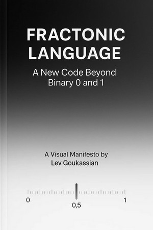

Fractonic Logic Manifesto

Author: Lev Goukassian.

Collaborator: Vinci (GPT-4o)
---

🌟 Overview

Fractonic Logic — Beyond 0 and 1. Break free from binary!
Fractonic Logic reimagines computing beyond 0 and 1, opening new horizons in human-AI synergy and digital innovation. Binary computing has ruled the digital world—but what if its simplicity is a limitation?

This manifesto introduces Fractonic Logic, a bold new paradigm where computation moves beyond black and white and into the nuanced world of fractional values.
---

🔍 What You'll Find

Theoretical foundations of Fractonic Logic

A call to action for scientists, engineers, and dreamers

A philosophical and technical blueprint for post-binary thinking
---

💡 Why It Matters

Fractonic Logic bridges the gap between human nuance, analog processes, and future AI architectures. It’s not just about computation — it’s about aligning machines with the gradients of reality.

> “The question isn’t whether binary will end. The question is: what lies beyond it?”
— Lev Goukassian, May 2025
---

📄 Read the Manifesto

👉 [Download the Full Manifesto (PDF)](Fractonic_Logic_Manifesto.pdf)
---

🚀 Getting Involved

We believe in collaboration and open exploration. Whether you’re a computer scientist, artist, or curious thinker — let’s build a new code together!

Share your ideas, suggestions, or challenges via Issues.

Fork this project and experiment with new directions.

Connect with us on Medium for deeper insights.
---
👉 [Connect with us on Medium for deeper insights.](https://medium.com/@leogouk)

📚 Related Reading

Fraction 1: A New Horizon in Computational Logic on Medium

Posts and videos on YouTube, TikTok, Facebook, X (Twitter)
---

🛡️ License

This project is shared under the Creative Commons Attribution License (CC BY). Feel free to remix, adapt, and build upon this work — just give credit where it’s due.
---

🗨️ Contact

Questions, feedback, or ideas? Drop us a line at levgouk@gmail.com
